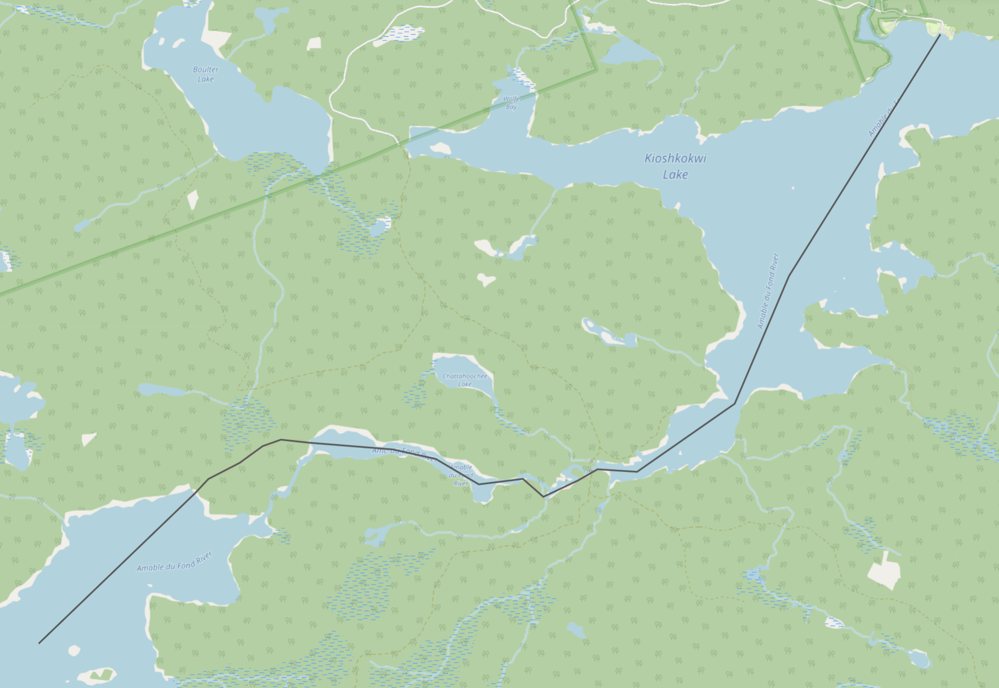
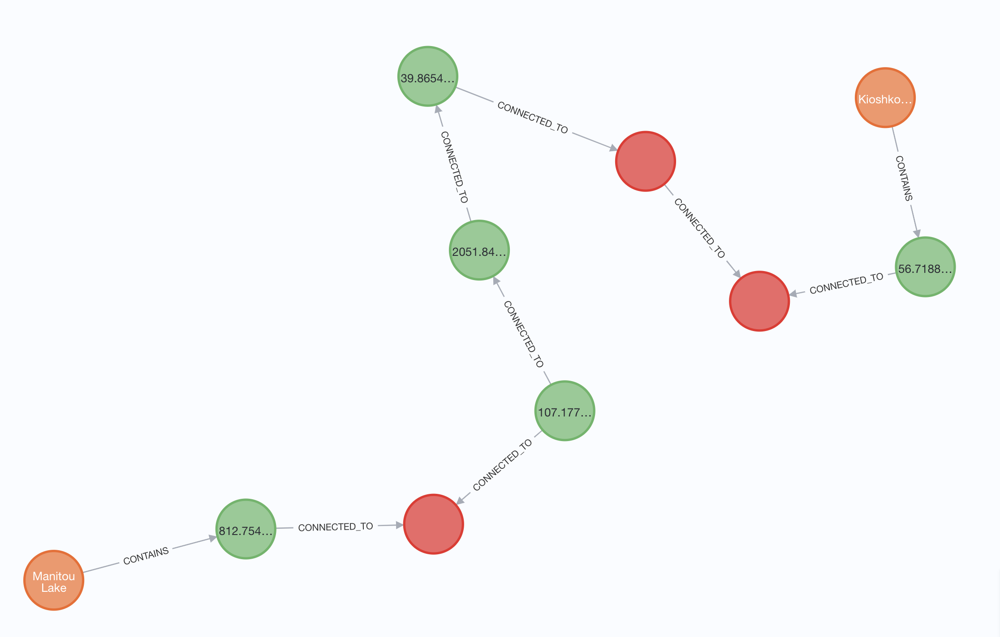

# Canoe Route Dataset Builder

This folder contains the source files for creating an Algonquin canoe routes dataset. The primary outputs of the dataset are:
1. A connectivity graph of canoe routes, portages, and the lakes they traverse
2. GeoJSON and .mbtiles data for rendering the above data in the browser

The goal of the connectivity graph is to allow down-stream route-finding algorithms to plot one or more paths between points in Algonquin park, traversed by canoe.

For example, if starting at the Kioshkokwi Lake Access Point, how does one navigate Manitou Lake?



The human-derived description would be something like:
1. Depart the Kioshkokwi access point, heading south-west
2. Paddle 6km
3. Take the 265m portage + 310m portage to the next section of the Amable du Fond River
5. Paddle west 2km
6. Take the 1355m portage to Manitou Lake

However to create a computer-generated navigation route, the followin graph traversal is equivalent to the above:
1. Start: node/8720251656 (Kioshkokwi Access Point)
2. way/1218622840
3. way/1218622841
4. way/1218622842
5. way/1218622844
6. way/974505243 (portage)
7. way/1218622837
8. way/1218622838
9.  way/1218622835
10. way/106580107 (portage)
11. End: way/1218622829 (Manitou Lake)

The goal of the code in this directory is to build the graph of `nodes` and `ways` from Open Street Map (OSM) data.

## Approach

The high level approach applied here is a multi-phase data ETL "pipeline" that roughly breaks down as follows:

1. Request OSM-formatted data from Open Street Map for features within Algonquin park
2. Translate the OSM data to GeoJSON
3. Ingest each GeoJSON feature into a Sqlite geo-database indexed on the feature's bounding box
4. Augment and transform the data in the database (e.g. add labels)
5. Create a Neo4J graph DB based on feature intersections found by querying the Sqlite DB

### Take One

The first approach was to request lakes, rivers, and portages and build the graph based on their intersections. The result was a fairly extensive graph of all the lakes along with the rivers and portages that connect them in the park - about 12,000 nodes in the graph. With this graph it should be possible to find a path between two locations in the park

While this data was interesting and technically correct, it suffered from two primary shortcomings:
1. The graph was much bigger than necessary - most of the lakes in Algonquin are not accessible by canoe and most streams are not navigable by boat. As such, the majority of the graph was "useless"
2. There was no clear way of knowing what paths through the graph were actually navigable by canoe. Traversing between two lakes that have a portage between usually also has a stream between. The was no data in the graph that would suggest that the portage was the only viable option of transit. Some streams have OSM tags `canoe: no` but this is not the norm.

To address these issues I tried options like pruning the graph in Neo4j to remove subgraphs containing only unnamed lakes, streams that lead to nowhere, etc. This was not enough.

### Take Two

About 75% of Algonquin has features in OSM that define canoe routes - navigable paths through lakes, connecting to portages. While I didn't want to fallback to manually entered data, it seems to be a better approach. For *Take Two* I started by manually adding over 100 routes to OSM. I used an official Algonquin canoe route map combined with the Strava global GPS heatmap. Oh well.

With the park closer to completely mapped, we have much cleaner data to work with: A geojson relation containing hundreds of ways that define possible canoe routes through lakes and the portages and rivers than link them.

The result is a graph containing:
- ~2600 graph nodes (routes and lakes)
- ~2600 links between lakes and routes (ie this lake contains this route segment)
- ~5500 links between route nodes (this route segment is connected to these other two route segments)

The pipeline is now as follows:

#### OSM Fetch and GeoJson convert
The first stage queries OSM for all ways contained within the `Algonquin Park Canoe Routes Network` relation via the Overpass API using the following query:

```
[out:json];
area(id:3600910784)->.searchArea;
(
   nwr[route=canoe](area.searchArea);
);
(>;);
out geom;
```

This grabs the relation and then returns the sub nodes, ways, and relations.

The results are converted to GeoJson, lake areas are calculated (more on this later), and written to disk.

Run via:
```
node index.js fetchGeoJson
```

This generates files in `./data/osm` and `./data/geojson` directories.

### Build DB

The next stage puts all features into a geo-indexed DB table used to find feature intersections later.

The following command builds the Sqlite DB, populating only with canoe routes and lakes in preparation for later steps.
```
node index.js buildDB --types=canoe_route,lake
```

This stage can also augment data as it comes in, e.g. adding names to things by id if desired. Create a JSON file of id keys to properties objects in `./data/enrichments/additional_data.json` if desired.

This step builds a sqlite db at `./data/features.db`

### Prepare DB

The third stage prepares the data in the DB for graph creation. Many of the portages and canoe routes intersect with other routes midway through their path. This means that if one were to graph a route it would be possible that only a part of a route segment would need to be traversed before moving onto the next segment in the route. We want to avoid this such that each route segment is always traversed start to end, creating a true path graph.

This stage iterates over all route segments in the DB, finds all intersections, and if there are intersections midway through a segment it divides the segment up into smaller pieces.

After breaking up all segments, this stage iterates through all segments again and adds their length in metres to the GeoJSON objects. We'll use these lengths when creating our graph in the next step.

```
node index.js prepareDB
```

This stage reads and updates `./data/features.db`

### Build Graph

The final stage in the data pipeline is generating the Neo4J graph database of the final result. To do this we iterate over all route segments in the DB and find segments that intersect them. We add each segment to the graph using `:Path:Route` node type for in-water routes, `:Path:Portage` for portages. For each intersection we link the segments using a `:CONNECTED_TO` link. For in-water routes we find the lakes or rivers that contain them (added as nodes of type `:Feature:Lake` or `:Feature:River`) and link the containing water using a `:CONTAINS` link in the graph.

For this stage, Neo4J must be running and a password must be set:
```
export NEO4J_PASSWORD=abcd1234

# Start Neo4J in docker
./start-neo4j.sh

# Build the graph
node index.js buildGraph
```

Once the graph is populated, you can start finding routes!

## Using the graph
### Find the shortest route between two lakes
```
match p=shortestpath(
  (:Lake {name:"Kioshkokwi Lake"})-[*1..10]-(:Lake {name:"Manitou Lake"})
)
return p,
reduce(total=0, number in [ n IN nodes(p) where n:Portage | n.length] | total + number) as portage,
reduce(total=0, number in [ n IN nodes(p) where n:Route | n.length] | total + number) as paddle;
```



- Paddling Distance: 3,068m
- Portage Distance: 2,314m
